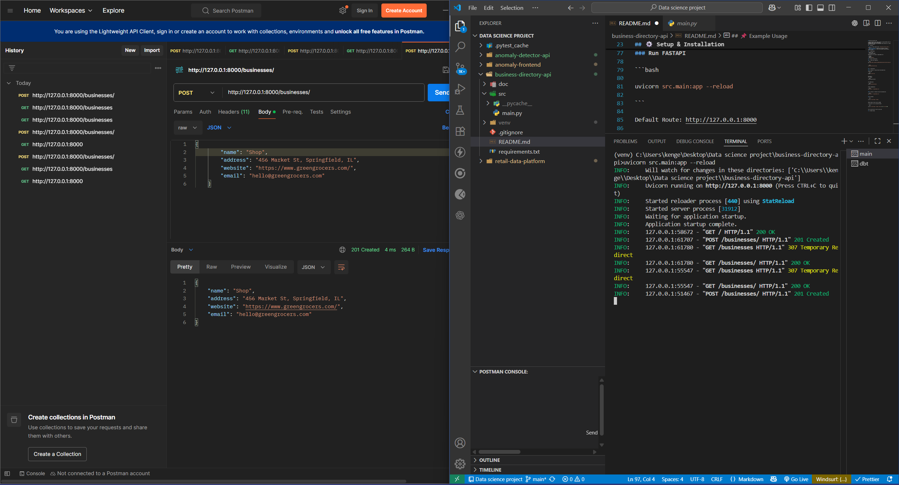

## Business Directory API

A simple FastAPI project that provides a minimal RESTful API for managing a basic list of businesses.
It demonstrates Python API development best practices in a small, easy-to-run project.

## 🚀 Features

- **GET /** — Root health check (`"Business Directory API is running."`)
- **GET /businesses/** — Retrieve all business listings
- **POST /businesses/** — Add a new business (name, address, website, email)

## 🛠️ Requirements

- Python 3.10+
- pip package manager

Dependencies are listed in requirements.txt:

- fastapi
- uvicorn
- pydantic[email]

## ⚙️ Setup & Installation

### 1. Clone this repository

```bash
git clone https://github.com/NRicky25/business-directory-api.git

```

```bash
cd business-directory-api

```

### 2. Installation

#### 2.1 Option 1: Using Virtual Environment(ven)

Create venv

```bash
python -m venv venv

```

Activate it
For windows:

```bash
venv\Scripts\activate

```

For macOS/Linux:

```bash
source venv/bin/activate

```

Install dependencies

```bash
pip install -r requirements.txt

```

#### 2.2 Option 2: Without Virtual Environment(ven)

```bash
pip install -r requirements.txt

```

### Run FASTAPI

```bash

uvicorn src.main:app --reload

```

Default Route: http://127.0.0.1:8000

if you want to run on Custom Port/Host

```bash

uvicorn src.main:app --reload --host 0.0.0.0 --port 5000

```

You can switch host or port as you wish

## 📌 Example Usage

### Using Postman

### Health check

<p align="center">  </p>

### Get Info from FASTAPI

<p align="center">  </p>

### Send create to FASTAPI

<p align="center">  </p>

## 🧹 Project Structure

```
business-directory-api/
├─ src/
│  └─ main.py         # FastAPI application
├─ requirements.txt   # Dependencies
├─ README.md          # Documentation
└─ .gitignore         # Ignore for github push
```
